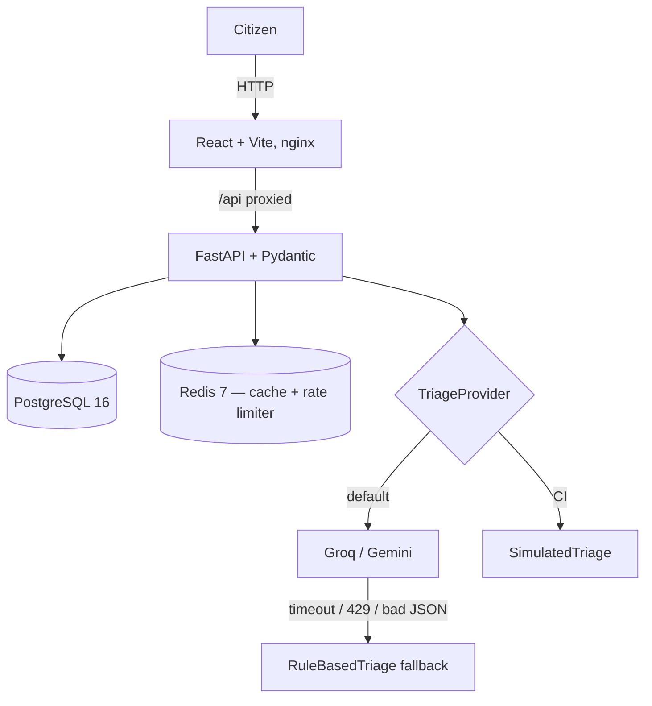

# CivicPulse

TODO(you): one-line pitch + badges (CI status, license, etc.) — see §J of the
rubric: "README.md: problem statement, badges, Mermaid architecture diagram,
working one-command quickstart, API table, screenshots".

## Problem

TODO(you): 2-3 sentences in your own words — see assignment §1.1 for the
framing, but don't just paste it.

## Architecture

TODO(you): embed a Mermaid diagram here, e.g.:



Redraw this to match what you actually built, not the spec's original diagram.

## Quickstart

```bash
cp .env.example .env
# TODO(you): fill in real values in .env
docker compose up -d --build
```

TODO(you): once this actually works end-to-end, add the URLs (frontend,
backend docs at /docs, etc.) and confirm this quickstart works from a
genuinely clean clone before submitting (§5.3: broken quickstart is -5).

## API

| Method | Path | Behavior |
|---|---|---|
| POST | /api/complaints | Validate → triage → persist. 201 / 400 / 429 |
| GET | /api/complaints/{id} | 200 / 404 |
| GET | /api/complaints | Filter + paginate, returns total |
| PATCH | /api/complaints/{id}/status | Enforce state machine, 409 on invalid |
| GET | /api/stats | Aggregates, Redis-cached, X-Cache header |
| GET | /api/meta/providers | Active provider + last 20 triage outcomes |
| GET | /health | Liveness — never touches the database |
| GET | /ready | Readiness — Postgres + Redis reachability |
| GET | /metrics | Prometheus text format |

## Screenshots

TODO(you): add screenshots of the three frontend views once built.

## Tech stack

- Backend: FastAPI + Pydantic v2, SQLAlchemy (async), Alembic
- Frontend: React 18 + Vite + TypeScript, served by nginx
- Data: PostgreSQL 16, Redis 7
- Infra: Docker Compose (dev/prod), Kubernetes (Kustomize base + overlays), GitHub Actions

## Docs

- [Engineering Notes](docs/ENGINEERING-NOTES.md)
- [Runbook](docs/RUNBOOK.md)
- [AI Usage](docs/AI-USAGE.md)
- [ADRs](docs/adr/)

## License

TODO(you): add a LICENSE file and reference it here if your course requires one.
